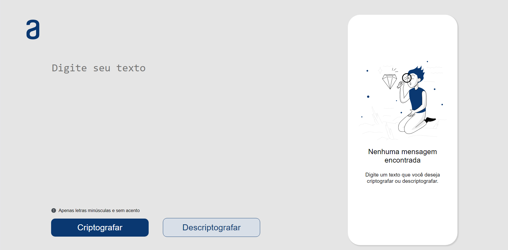
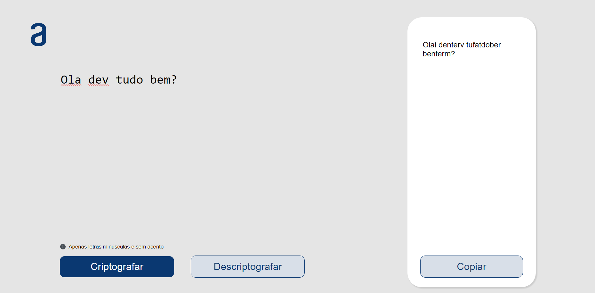
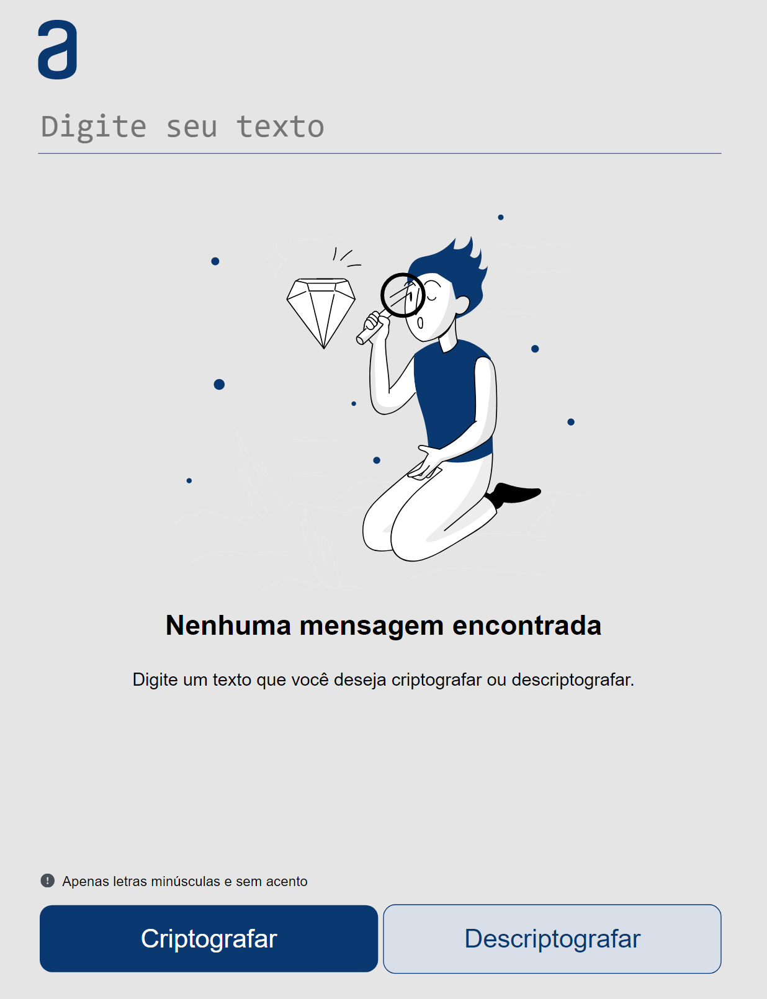
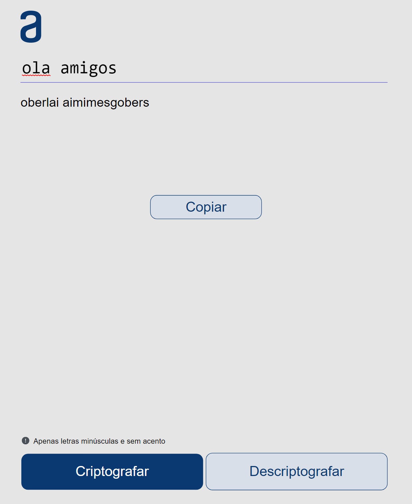
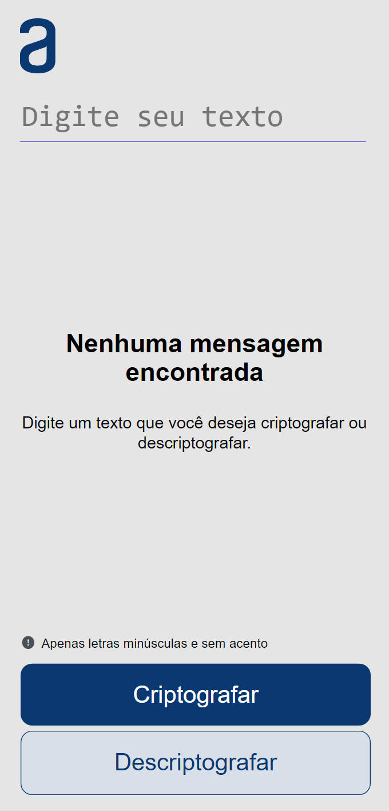
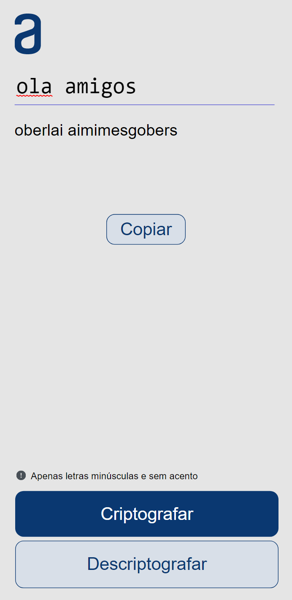

<h1>Decodificador de Texto</h1>

<h2>Sobre o projeto</h2>

O projeto Decodificador de texto é um challenge do bootcamp Alura+Oracle da turma 2. O objetivo do projeto é aperfeiçoar os conhecimentos em HTML, CSS, JavaScript e

<h2>Layout</h2>

<h3>Layout web</h3>

 

<h3>layout tablet</h3>

<h3>layout mobile</h3>

<h2>Tecnologias utilizadas no projeto</h2>

<ul>
    <li>HTML</li>
    <li>CSS</li>
    <li>JS</li>
</ul>

<h2>Autor</h2>

<addres><a href="https://www.linkedin.com/in/gabdevlopez/">https://www.linkedin.com/in/gabdevlopez/</a></addres>